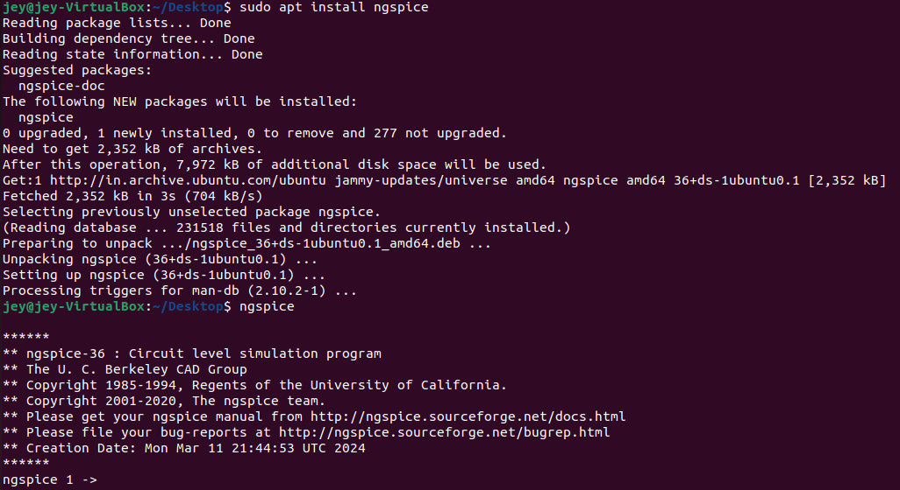

### 📸 Task 2: Installed Tools & Verification Screenshots

This section contains screenshots demonstrating the successful installation and verification of the open-source EDA tools used in the RTL-to-GDSII flow.

---

#### Tool Verification Screenshots

- [Yosys](#yosys)
- [Iverilog](#iverilog)
- [GTKWave](#gtkwave)
- [Ngspice](#ngspice)
- [Magic VLSI](#magic-vlsi)
- [Docker](#docker)
- [OpenLane](#openlane)

---

### Yosys

---

### Iverilog

---

### GTKWave

---

### Ngspice

---

### Magic VLSI

---

### OpenLane

